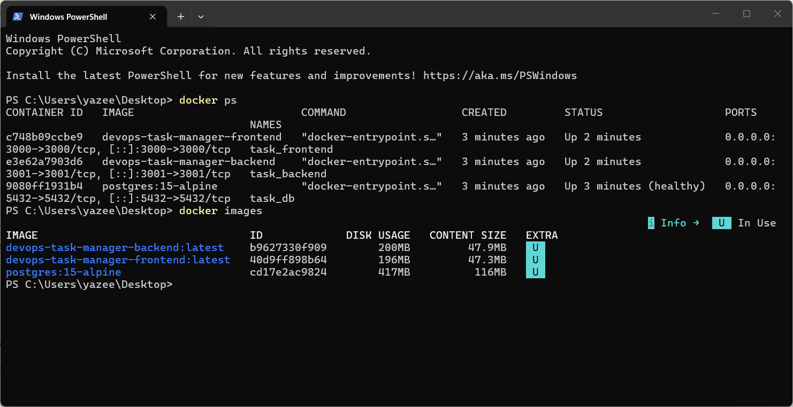
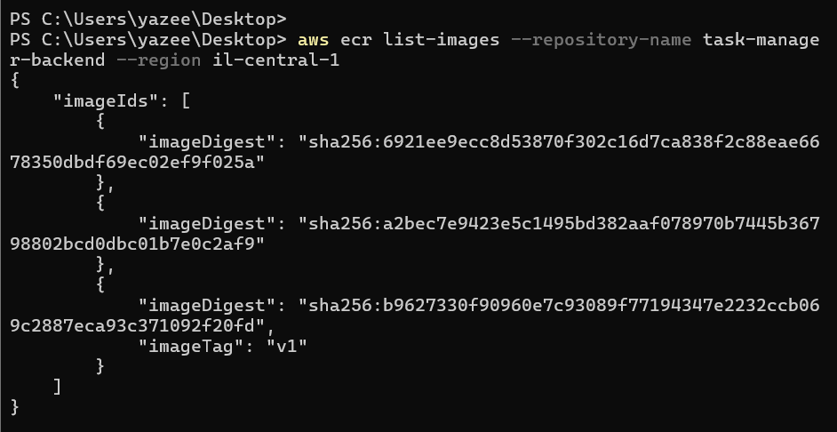
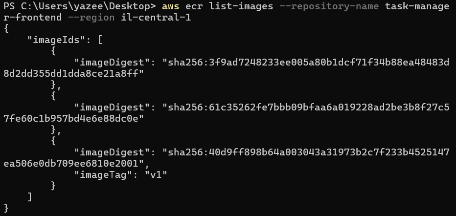
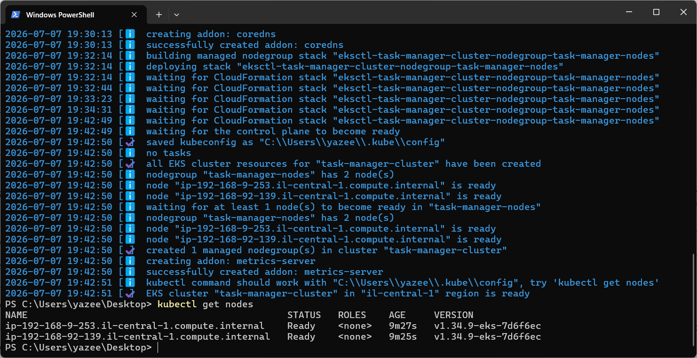
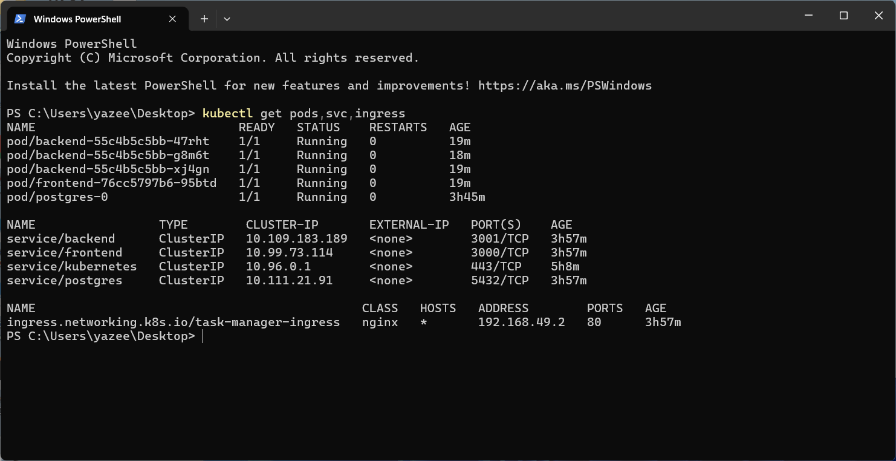
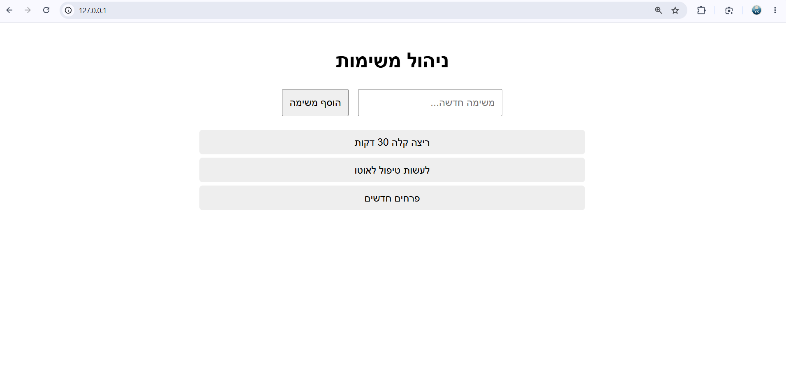
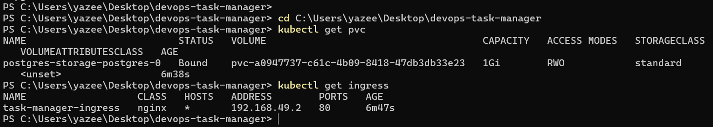
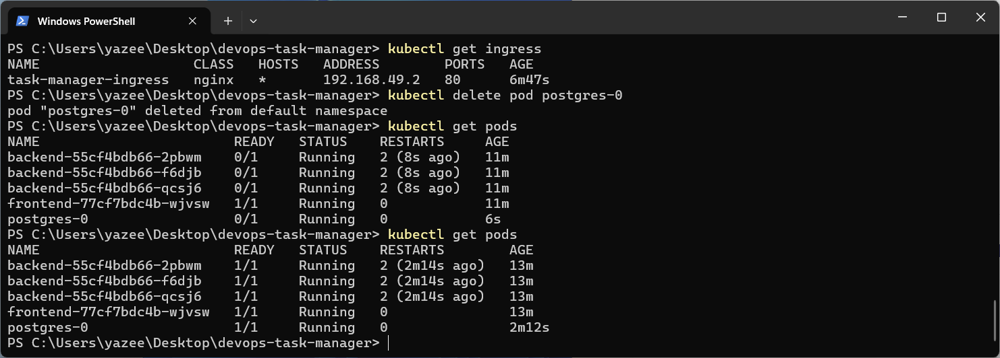
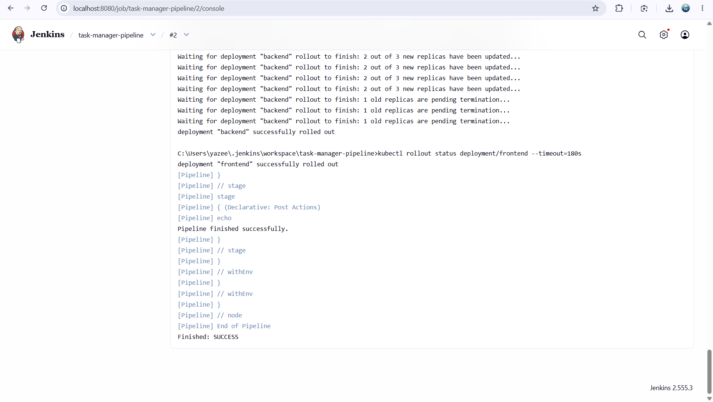
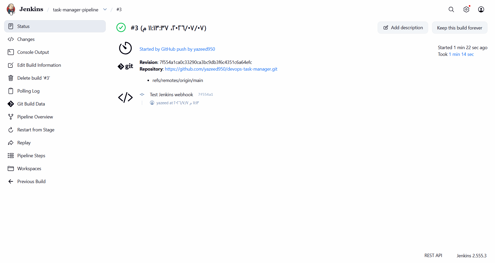

# DevOps Task Manager

This project is a DevOps deployment for a Task Manager application.

The application has:

- Frontend
- Backend API
- PostgreSQL Database

The project uses:

- Docker
- AWS ECR
- Kubernetes
- Minikube
- AWS EKS
- Jenkins
- GitHub Webhook
- ngrok

---

## Docker Local Run

The project was tested locally using Docker Compose.

```bash
docker compose up --build
```



---

## AWS ECR

Two Docker images were pushed to AWS ECR:

- Backend image
- Frontend image





---

## AWS EKS

An EKS cluster was created and the nodes were Ready.



---

## Kubernetes Deployment

The application was deployed to Kubernetes.

The deployment includes:

- 3 Backend pods
- 1 Frontend pod
- 1 PostgreSQL pod
- Services
- Ingress
- Secret
- Persistent Volume Claim

```bash
kubectl get pods,svc,ingress
```



---

## Application Running

The application was exposed using Ingress and opened successfully in the browser.



---

## PostgreSQL Persistence

PostgreSQL uses PVC to keep the data after pod restart.

```bash
kubectl get pvc
```



PostgreSQL pod restart test:



---

## Jenkins Pipeline

Jenkins pipeline builds the Docker images, pushes them to ECR, and deploys the new version to Kubernetes.



---

## GitHub Webhook

GitHub Webhook was configured to trigger Jenkins automatically after a push.



---

## Project Structure

```text
backend/
frontend/
k8s/
screenshots/
docker-compose.yml
Jenkinsfile
README.md
```

---

## Notes

- Each Jenkins build creates a new image tag.
- Kubernetes uses rolling updates.
- PostgreSQL data is saved using PVC.
- Secrets are stored in Kubernetes Secret.
- Backend readiness check uses `/health`.
